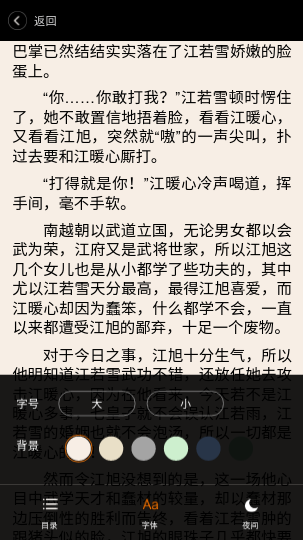

# H5小说阅读器

**项目简介**

* HTML5+CSS3实现页面
* Vue用来实现客户端数据的渲染
* ejs实现服务端数据渲染模板
* zepto用来操作DOM
* express框架与mock数据一起实现前后端分离的开发

**启动项目**
```
npm start
```

**项目展示**




**项目结构**
```
|－mock        模拟后台json数据
|－servies
|　　|－webAppService.js
|－static　　   静态资源文件
|　　|－css
|　　|－img
|　　|－script
|－view        视图文件目录
|　　|－include
|－.gitignore
|－app.js       入口文件
|－README.md
```

