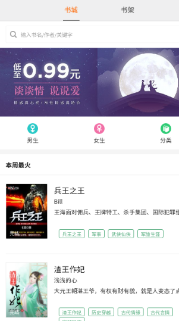

# H5小说阅读器

**项目简介**

* HTML5+CSS3实现页面
* Vue用来实现客户端数据的渲染
* ejs实现服务端数据渲染模板
* express框架与mock数据一起实现前后端分离的开发

----------------------------------
**项目展示**




-----------------------------------------

**启动项目**

```
npm start
```


